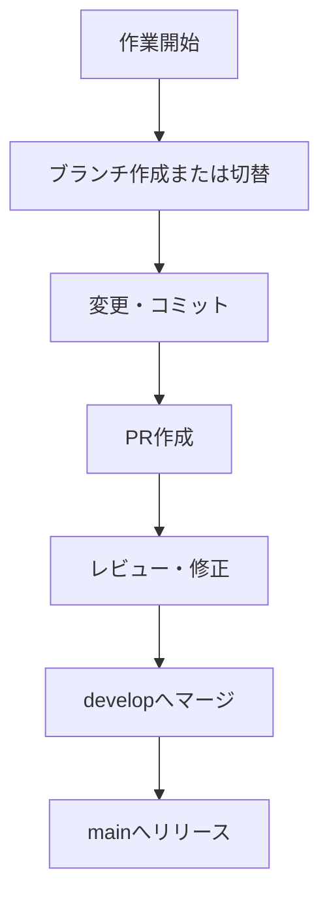

# Git Helper Skill Reference

このドキュメントは、Git Helper Skill の補足資料および運用ルールを示します。
Claude は必要に応じてこの内容を参照して、安全な操作を支援します。

---

## 1. ブランチ運用ポリシー

| 種別 | 命名例 | 目的 |
|------|--------|------|
| main | `main` | 本番リリース用の安定ブランチ |
| develop | `develop` | 日常開発統合ブランチ |
| feature | `feature/login-ui` | 新機能・改修ブランチ |
| hotfix | `hotfix/urgent-fix` | 緊急修正ブランチ |

### 運用ルール
- 新しいブランチ名は開発者が手動指定。
  Claude は命名補助のみ（例：「login-ui」「refactor-renderer」など）。
- 統合はすべて **merge commit** で行い、履歴の明確化を優先。
- rebase は使用しない方針。

---

## 2. コミットメッセージ規約

**Conventional Commits** 準拠。

```
<type>(<scope>): <summary>
```

### type 一覧
| type | 用途 |
|------|------|
| feat | 機能追加 |
| fix | 不具合修正 |
| docs | ドキュメント変更 |
| refactor | 構造変更（機能影響なし） |
| chore | 環境・設定変更 |
| test | テスト追加／修正 |

---

## 3. 安全対策・ガードレール

1. `git status` / `git diff` の確認なしにコミット・push しない。
2. `.env`, `secrets/`, `config/` のような機密情報をコミットしない。
3. `.gitignore` を常に最新に維持。
4. `reset --hard`, `push -f` は禁止。`--force-with-lease` のみ許可。
5. Claude が検出した `.pem` / `.key` / `.env` などの機密拡張子は警告を出す。

---

## 4. タグ付け・リリース手順

- タグ命名: `v<MAJOR>.<MINOR>.<PATCH>`
- 署名付きタグ推奨：
```bash
  git tag -s v1.4.2 -m "release 1.4.2"
  git push origin v1.4.2
```

* リリース前に `CHANGELOG.md` の更新と差分確認を行う。

---

## 5. 推奨 Git 設定

```bash
git config --global pull.rebase false
git config --global push.autoSetupRemote true
git config --global commit.gpgsign true
```

---

## 6. 作業フロー概要



---

## 7. 注意事項

* Claude が提案したコマンドは実行前に内容を確認する。
* Skill 実行中の削除・merge 操作後は `git status` を確認すること。

